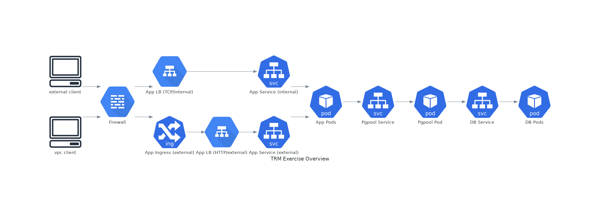

# Proposed Solution

The system has two components: app & database. The app is a simple Python Flask app that connects to the database. The database is a PostgreSQL cluster with Pgpool as the connection broker.

## Assumptions
1. On-premises deployment is out of scope for this exercise. But must be deployable on GCP by customers into their VPCs.
1. This is not intended to handle massive traffic or amounts of data but could be scaled to do so. This implementation is not multi-region.
1. This needs to run in GCP. (Of AWS/Azure/GCP I am by far the least knowledgable about GCP so I had to do a lot of research to translate what I know from the other two.)
1. For "real" use this solution would have CI/CD pipelines that
    - build and release container images
    - provide a reference implementation (for customers) to deploy the database and application to the K8s cluter

## Highlights

### General
In general, the solution must:
- Pass SOC2 certification standard
- Deploy in a repeatable and mostly automated manner across multiple Customer VPCs
- Follow the Open/Close principle—hard to modify, but easy to extend

To achieve this:
- The solution generally aligns with SOC2 standards
- App and database deployments are codified and dynamic enough to run in other customers' GCP VPCs
- Infrastructure should be codified and deployed via Terraform or Deployment Manager
- The application is "sealed" in a container image but can be extended by making derivative images and/or adding anciallary capabilities to the environment (e.g. a message queue) that connect with each other via K8s services

### App
The app must:

- Limit access to a subset of one or more Public or VPC IPs
- Run multiple instances of the Python application
- Execute "zero-downtime" deployments

To achieve this:

- App runs as a deployment scaled to multiple pods on GKE
- For internal (VPC) clients, the app has a service tied to an internal load balancer
- For external (non-VPC) clients, the app has an Ingress (HTTP LB)
- Load balancers can be protected by VPC firewall rules as needed
- The application can scale by adjusting the deployment's replica count
- The application can scale automatically via HPA
- The application uses K8s rolling deployments, which can be used to roll out patches or other updates
- For use with by customers, the app container image should be versioned & published via a pipeline and distributed via a shared registry
- **Application can be monitored**

### Database
The database must:

- Use PostgreSQL or, optionally, CitusDB
- Update the DB software independent of the data on disk
- Tune DB configuration parameters easily
- Dynamically configure cluster size, and machine configuration (e.g, instance types)

To achieve this:

- PostgreSQL cluster (StatefulSet) is deployed via Helm chart
   - For real-world use, more performant storage should be used
   - Database is running on K8s for the ability to scale nodes horizontally in a StatefulSet, but running on VMs may well be a better option for a number of reasons including performance and configuration flexibility
- RPO/RTO are key in dictating DR & HA posture
- Pgpool facilitates connections to the cluster
- Database nodes use PersistentVolumes for their storage, so the DB engine pod can be upgraded
- If necessary, can take a snapshot of PersistentVolumes and mount to another system (e.g., migrate to a VM and mount the database storage)
   - This assumes that `pg_dump` would not be performant enough for extremely large data sets, so storage snapshots would be more feasible
   - Another potential solution to ensure consistency: Create a K8s CronJob that connects the the database, does a PostgreSQL CHECKPOINT to flush everything to disk and then calls GCP API to snapshot the underlying PV disk.
- Helm release values can be used to alter DB configuration (ConfigMaps)
- StatefulSet scale can be changed to change cluster size
- Can set resource requests & limits to add CPU & memory
- **Database can be monitored**

## Design
The following diagrams provide an overview of the system and a more detailed look at the app and database components.

### Overview

### Detailed View
The connection from app pods to the Pgpool service is not shown to avoid making a complex diagram moreso.

## Future Enhancements
There are a number of things that could improve upon this solution, including:
1. Use CitusDB instead of PostgreSQL. This may also result in a move from running the database on K8s to running on VMs. Would need more/different bootstrapping to bring a cluster and manage nodes and data.
1. Use DNS to provide friendly URLs for the API.
1. Use TLS to secure API acccess. Ensure that connections to the database are encrypted.
1. If app continues to run in K8s, potentially package as a Helm chart for easier customer adoption and to further enforce open/close principal.

## Options Considered
These are some of the other design and implementation options I considered.

### App

1. Cloud Run
1. GKE
1. Cloud Functions
1. App Engine
1. Compute Engine

### Database

- Cloud SQL (with [proxy](https://cloud.google.com/sql/docs/mysql/connect-kubernetes-engine))
- PostgreSQL (+Citus) on Compute Engine
- PostgreSQL on GKE
- Citus DB on GKE (https://hub.docker.com/r/citusdata/citus & https://github.com/citusdata/docker); appears to support clustering with docker-compose
- [Crunchy Data PostgreSQL K8s Operator](https://github.com/CrunchyData/postgres-operator) as an alternate way to deploy PostgreSQL on K8s
